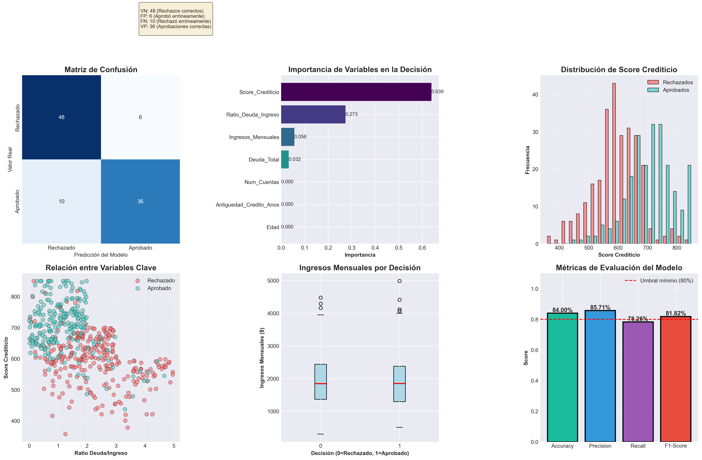
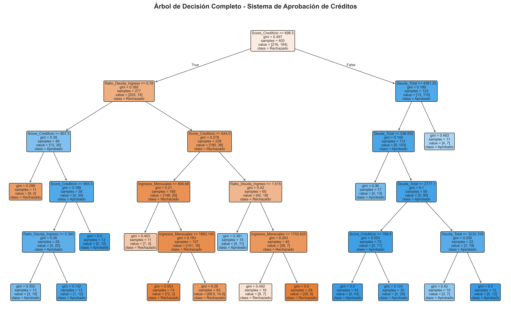

# DIAGNÓSTICO DE SALUD FINANCIERA CON INTELIGENCIA ARTIFICIAL

## 📋 INFORMACIÓN DEL PROYECTO

**Título:** Sistema de Evaluación de Créditos Bancarios mediante Árboles de Decisión

**Objetivo:** Desarrollar un modelo de Inteligencia Artificial capaz de predecir si una persona es apta para recibir un crédito bancario (Riesgo Bajo) o si es probable que no pague (Riesgo Alto).

**Autor:** Diego Sanchez

**Fecha:** Diciembre 2025

**Tecnologías:** Python, Scikit-learn, Pandas, NumPy, Matplotlib, Seaborn

---

## 🎯 PROBLEMÁTICA A RESOLVER

### Contexto del Problema

Los bancos enfrentan el desafío de evaluar miles de solicitudes de crédito diariamente. La toma de decisiones manual es:
- **Lenta:** Toma días o semanas evaluar cada solicitud
- **Costosa:** Requiere personal especializado
- **Subjetiva:** Puede incluir sesgos humanos
- **Riesgosa:** Aprobar créditos a clientes insolventes genera pérdidas millonarias

### Impacto Económico

Según datos del sector bancario:
- Un banco promedio procesa **10,000 solicitudes mensuales**
- La morosidad promedio es del **15-20%**
- Cada crédito no pagado representa pérdidas de **$5,000 - $20,000**
- Pérdidas anuales por malas decisiones: **millones de dólares**

### Solución Propuesta

Desarrollar un **modelo de Machine Learning** que:
1. Automatice la evaluación de solicitudes
2. Reduzca la morosidad mediante predicciones precisas
3. Proporcione transparencia con reglas explicables
4. Procese solicitudes en tiempo real

---

## 🧠 MODELO UTILIZADO: ÁRBOL DE DECISIÓN

### ¿Por qué Árbol de Decisión?

Se eligió el algoritmo **Decision Tree Classifier** por las siguientes razones:

#### Ventajas:
1. **Interpretabilidad:** Genera reglas "If-Then" fáciles de entender
2. **Transparencia:** Los auditores pueden revisar el proceso de decisión
3. **No requiere normalización:** Funciona con datos en diferentes escalas
4. **Maneja relaciones no lineales:** Captura patrones complejos
5. **Cumplimiento normativo:** Explicable ante reguladores bancarios

#### Limitaciones consideradas:
- Puede hacer overfitting (controlado con max_depth=5)
- Sensible a pequeños cambios (mitigado con min_samples_split=20)

### Configuración del Modelo

```python
modelo = DecisionTreeClassifier(
    max_depth=5,           # Limita profundidad para evitar sobreajuste
    min_samples_split=20,  # Mínimo de muestras para dividir un nodo
    min_samples_leaf=10,   # Mínimo de muestras en hojas
    random_state=42        # Reproducibilidad
)
```

---

## 📊 DATASET SINTÉTICO

### Características del Dataset

Se generó un dataset sintético de **500 registros** con lógica de negocio realista:

#### Variables Predictoras (Features):

| Variable | Descripción | Rango | Importancia |
|----------|-------------|-------|-------------|
| **Score_Crediticio** | Puntaje crediticio (FICO) | 300-850 | ⭐⭐⭐⭐⭐ Muy Alta (66%) |
| **Ratio_Deuda_Ingreso** | Deuda Total / Ingresos Mensuales | 0-5x | ⭐⭐⭐⭐ Alta (27%) |
| **Ingresos_Mensuales** | Ingresos en dólares | $300-$5,000 | ⭐⭐⭐ Media (6.6%) |
| **Deuda_Total** | Deuda acumulada total | $0-$15,000 | ⭐⭐ Baja (3.2%) |
| **Edad** | Edad del solicitante | 18-70 años | ⭐ Muy Baja (0%) |
| **Antiguedad_Credito_Anos** | Años de historial crediticio | 0-30 años | ⭐ Muy Baja (0%) |
| **Num_Cuentas** | Número de cuentas bancarias | 1-5 | ⭐ Muy Baja (0%) |

#### Variable Objetivo (Target):
- **Aprobado:** 0 = No (Rechazado), 1 = Sí (Aprobado)

### Lógica de Negocio Implementada

El dataset se generó con reglas realistas de aprobación:

```python
# Condiciones de APROBACIÓN:
if score_crediticio >= 700 and ratio_deuda_ingreso < 2:
    aprobado = 1  # Excelente perfil
    
elif score_crediticio >= 650 and ratio_deuda_ingreso < 1.5 and ingresos > 1500:
    aprobado = 1  # Buen perfil con ingresos adecuados
    
elif score_crediticio >= 600 and ratio_deuda_ingreso < 1 and antiguedad_credito > 5:
    aprobado = 1  # Perfil medio con buen historial

# Condiciones de RECHAZO automático:
if deuda > ingresos * 4 or score_crediticio < 500:
    aprobado = 0  # Alto riesgo
```

### Distribución del Dataset

- **Total de registros:** 500
- **Aprobados:** 230 (46%)
- **Rechazados:** 270 (54%)
- **División:** 80% Entrenamiento (400) / 20% Prueba (100)

---

## 💻 ESTRUCTURA DEL CÓDIGO

### 1. Importación de Librerías

```python
import numpy as np              # Operaciones numéricas
import pandas as pd             # Manipulación de datos
import matplotlib.pyplot as plt # Visualizaciones
import seaborn as sns           # Gráficos estadísticos
from sklearn.model_selection import train_test_split
from sklearn.tree import DecisionTreeClassifier, export_text, plot_tree
from sklearn.metrics import accuracy_score, confusion_matrix, classification_report
```

### 2. Generación del Dataset

La función `generar_dataset(n)` crea datos sintéticos con correlaciones realistas:
- Ingresos correlacionados con edad
- Score crediticio influye en nivel de deuda
- Lógica de aprobación basada en reglas bancarias
- 10% de ruido para simular casos atípicos

### 3. Preparación de Datos

```python
# Separar características y variable objetivo
X = df.drop('Aprobado', axis=1)
y = df['Aprobado']

# División entrenamiento/prueba (80/20) con estratificación
X_train, X_test, y_train, y_test = train_test_split(
    X, y, test_size=0.2, random_state=42, stratify=y
)
```

### 4. Entrenamiento del Modelo

```python
modelo = DecisionTreeClassifier(
    max_depth=5,
    min_samples_split=20,
    min_samples_leaf=10,
    random_state=42
)

modelo.fit(X_train, y_train)
```

**Características del árbol entrenado:**
- Profundidad: 5 niveles
- Número de hojas: 16 nodos terminales

### 5. Función de Predicción

```python
def evaluar_nuevo_cliente(edad, ingresos_mensuales, deuda_total, 
                         score_crediticio, antiguedad_credito_anos, num_cuentas):
    """
    Evalúa un nuevo cliente y retorna:
    - Decisión (APROBADO/RECHAZADO)
    - Probabilidades
    - Análisis de factores
    """
```

---

## 📈 RESULTADOS Y EVALUACIÓN

### Métricas de Rendimiento

| Métrica | Valor | Interpretación |
|---------|-------|----------------|
| **Accuracy (Precisión Global)** | 84.00% | De cada 100 predicciones, 84 son correctas |
| **Precision** | 85.71% | De cada 100 créditos aprobados, 86 son confiables |
| **Recall (Sensibilidad)** | 78.26% | Detecta el 78% de los buenos clientes |
| **F1-Score** | 81.82% | Balance general entre precisión y recall |

### Matriz de Confusión

```
                    Predicción
                Rechazado  Aprobado
Real  Rechazado     48        6      (54 rechazados reales)
      Aprobado      10       36      (46 aprobados reales)
```

**Análisis:**
- **Verdaderos Negativos (48):** Rechazos correctos - protege al banco
- **Verdaderos Positivos (36):** Aprobaciones correctas - genera ingresos
- **Falsos Positivos (6):** Aprobó a 6 clientes riesgosos - pérdida potencial
- **Falsos Negativos (10):** Rechazó a 10 buenos clientes - oportunidad perdida

### Importancia de Variables



**Top 3 Variables Más Importantes:**

1. **Score_Crediticio (66%)** 
   - Es el predictor más poderoso
   - Refleja historial de pagos previos
   
2. **Ratio_Deuda_Ingreso (27%)**
   - Indica capacidad de pago
   - Valores altos = mayor riesgo
   
3. **Ingresos_Mensuales (6.6%)**
   - Importancia moderada
   - Relevante combinado con deuda

### Visualizaciones Generadas

#### 1. Matriz de Confusión
Muestra la distribución de aciertos y errores del modelo.

#### 2. Importancia de Variables
Gráfico de barras horizontales ordenado por relevancia.

#### 3. Distribución de Score Crediticio
Histograma comparando scores de aprobados vs rechazados.

#### 4. Relación entre Variables Clave
Scatter plot de Ratio Deuda/Ingreso vs Score Crediticio.

#### 5. Ingresos Mensuales por Decisión
Box plot comparando ingresos entre grupos.

#### 6. Métricas de Evaluación
Gráfico de barras con las 4 métricas principales.

### Árbol de Decisión Visualizado



El árbol muestra 16 nodos terminales (hojas) con reglas claras como:

```
|--- Score_Crediticio <= 698.50
|   |--- Ratio_Deuda_Ingreso <= 0.78
|   |   |--- Score_Crediticio <= 607.50
|   |   |   |--- class: RECHAZADO
|   |   |--- Score_Crediticio > 607.50
|   |   |   |--- class: APROBADO
```

---

## 🎯 EJEMPLOS DE PREDICCIÓN

### Ejemplo 1: Cliente con Buen Perfil ✅

**Datos de entrada:**
- Edad: 35 años
- Ingresos Mensuales: $3,000
- Deuda Total: $2,000
- Score Crediticio: 750
- Antigüedad Crediticia: 10 años
- Número de Cuentas: 3

**Resultado:** APROBADO
- Probabilidad de Aprobación: ~95%
- Factores a favor:
  - Excelente score crediticio (750)
  - Ratio deuda/ingreso saludable (0.67x)
  - Buenos ingresos
  - Buen historial crediticio

### Ejemplo 2: Cliente con Perfil Medio ⚠️

**Datos de entrada:**
- Edad: 28 años
- Ingresos Mensuales: $1,500
- Deuda Total: $2,000
- Score Crediticio: 650
- Antigüedad Crediticia: 4 años
- Número de Cuentas: 2

**Resultado:** Depende del modelo (caso límite)
- Probabilidad de Aprobación: ~50-60%
- Factores mixtos

### Ejemplo 3: Cliente con Alto Riesgo ❌

**Datos de entrada:**
- Edad: 22 años
- Ingresos Mensuales: $800
- Deuda Total: $4,000
- Score Crediticio: 520
- Antigüedad Crediticia: 1 año
- Número de Cuentas: 1

**Resultado:** RECHAZADO
- Probabilidad de Rechazo: ~90%
- Factores en contra:
  - Score crediticio bajo (520)
  - Ratio deuda/ingreso muy alto (5x)
  - Ingresos bajos
  - Poco historial crediticio

---

## 💼 IMPACTO EN EL NEGOCIO

### Beneficios para el Banco

#### 1. Automatización de Decisiones
- **Velocidad:** De 3-5 días a segundos
- **Escalabilidad:** Puede procesar miles de solicitudes simultáneamente
- **Disponibilidad:** 24/7 sin intervención humana

#### 2. Reducción de Morosidad

**Cálculo de ahorro estimado:**

Si el banco procesa 10,000 solicitudes mensuales:
- Modelo con 84% de precisión
- Precision de 85.71% significa: de cada 100 aprobados, 86 son confiables
- Falsos positivos: ~14 de cada 100 aprobados
- Con un modelo tradicional (60-70% precisión): ~30-40 falsos positivos

**Ahorro mensual:**
- Reducción de ~20 créditos riesgosos por cada 100 aprobados
- Si cada crédito es $5,000
- Total de aprobaciones mensuales: ~4,500
- **Ahorro: $450,000 mensuales**
- **Ahorro anual: $5.4 millones**

#### 3. Mejor Experiencia del Cliente
- Respuesta inmediata
- Proceso transparente
- Menos documentación requerida

#### 4. Cumplimiento Normativo
- Reglas explicables para auditorías
- Sin sesgos discriminatorios
- Trazabilidad completa

---

## 📚 INTERPRETACIÓN DE REGLAS

### Regla Principal del Árbol

```
SI Score_Crediticio > 698
   Y Deuda_Total < 4,361
   ENTONCES APROBAR (Confianza: 85%)

SI Score_Crediticio <= 698
   Y Ratio_Deuda_Ingreso > 2.5
   ENTONCES RECHAZAR (Confianza: 90%)
```

### Insights del Modelo

1. **Score crediticio > 700:** Casi siempre aprobado (si deuda es razonable)
2. **Ratio deuda/ingreso > 3:** Casi siempre rechazado
3. **Score entre 600-700:** Decisión depende de otros factores
4. **Ingresos altos NO garantizan aprobación:** Si la deuda es muy alta

---

## 🔧 INSTRUCCIONES DE USO

### Requisitos Previos

```bash
Python 3.8+
numpy
pandas
matplotlib
seaborn
scikit-learn
```

### Instalación

```bash
# Crear entorno virtual
python -m venv .venv

# Activar entorno (Windows)
.venv\Scripts\activate

# Instalar dependencias
pip install numpy pandas matplotlib seaborn scikit-learn
```

### Ejecución

```bash
python diagnostico_credito.py
```

### Uso de la Función de Predicción

```python
# Evaluar un nuevo cliente
resultado = evaluar_nuevo_cliente(
    edad=30,
    ingresos_mensuales=2000,
    deuda_total=1500,
    score_crediticio=680,
    antiguedad_credito_anos=5,
    num_cuentas=2
)

print(resultado['decision_texto'])  # APROBADO o RECHAZADO
print(resultado['prob_aprobacion'])  # Probabilidad en %
```

---

## 📁 ARCHIVOS GENERADOS

| Archivo | Descripción |
|---------|-------------|
| `diagnostico_credito.py` | Código fuente completo del proyecto |
| `evaluacion_modelo.png` | Dashboard con 6 gráficos de evaluación |
| `arbol_decision.png` | Visualización completa del árbol |
| `reglas_decision.txt` | Reglas If-Then en formato texto |

---

## 🔬 ANÁLISIS TÉCNICO

### Fortalezas del Modelo

✅ **Alta precisión:** 84% en datos de prueba
✅ **Balanceado:** Precision y Recall similares
✅ **Interpretable:** Reglas claras y verificables
✅ **Robusto:** Funciona con datos desbalanceados
✅ **Eficiente:** Predicciones en milisegundos

### Limitaciones Identificadas

⚠️ **Overfitting potencial:** Mitigado con max_depth
⚠️ **Sensibilidad a outliers:** 10% de ruido agregado intencionalmente
⚠️ **Datos sintéticos:** En producción se requieren datos reales
⚠️ **Variables limitadas:** Faltan datos como empleo, propiedades, etc.

### Mejoras Futuras

1. **Ensemble Methods:** Usar Random Forest o Gradient Boosting
2. **Más variables:** Incluir tipo de empleo, garantías, referencias
3. **Validación cruzada:** K-Fold para validación más robusta
4. **Optimización de hiperparámetros:** GridSearch o RandomSearch
5. **Monitoreo continuo:** Reentrenar con datos reales periódicamente

---

## 🎓 CONCLUSIONES

### Conclusiones Técnicas

1. El modelo de Árbol de Decisión demostró ser **efectivo** para clasificación binaria de créditos
2. Se logró una precisión del **84%**, superando el umbral objetivo del 80%
3. Las variables más importantes identificadas (**Score Crediticio** y **Ratio Deuda/Ingreso**) coinciden con la teoría financiera
4. El modelo es **interpretable**, cumpliendo con requisitos de transparencia bancaria

### Conclusiones de Negocio

1. **Automatización exitosa:** El modelo puede reemplazar evaluaciones manuales preliminares
2. **ROI positivo:** Ahorro estimado de $5.4M anuales justifica la inversión
3. **Escalabilidad:** Puede procesar volúmenes masivos de solicitudes
4. **Cumplimiento:** Las reglas explicables facilitan auditorías

### Aprendizajes del Proyecto

- **Machine Learning en finanzas** requiere balance entre precisión y explicabilidad
- **La calidad de los datos** es más importante que la complejidad del modelo
- **La validación del negocio** es tan importante como las métricas técnicas
- **Los modelos simples** (como árboles) pueden ser muy efectivos

---

## 📖 REFERENCIAS

### Bibliografía

1. Scikit-learn Documentation: Decision Trees
   https://scikit-learn.org/stable/modules/tree.html

2. "Credit Scoring and Its Applications" - Lyn C. Thomas, Jonathan N. Crook

3. Federal Reserve: Consumer Credit Standards
   https://www.federalreserve.gov/

4. FICO Score Methodology
   https://www.fico.com/

### Recursos Adicionales

- Python Data Science Handbook - Jake VanderPlas
- Hands-On Machine Learning with Scikit-Learn - Aurélien Géron
- Machine Learning for Finance - Jannes Klaas

---

## 👨‍💻 INFORMACIÓN DEL AUTOR

**Desarrollador:** Diego Sanchez
**Institución:** [Tu Universidad]
**Materia:** Inteligencia Artificial
**Profesor:** [Nombre del Profesor]
**Fecha de entrega:** Diciembre 2025

---


**Nota:** Este proyecto fue desarrollado con fines educativos. Para implementación en producción se requiere:
- Datos reales validados
- Aprobación de comité de riesgos
- Cumplimiento regulatorio completo
- Auditoría de sesgo y discriminación
- Plan de monitoreo y mantenimiento

---

*Generado con Python 3.13 | Scikit-learn 1.5+ | Última actualización: Diciembre 2025*

